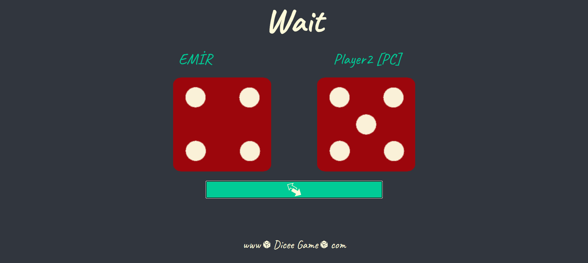
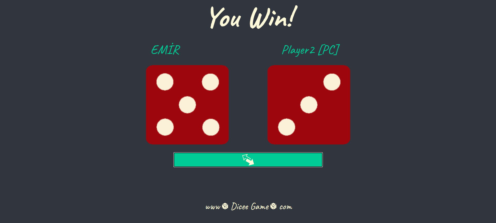
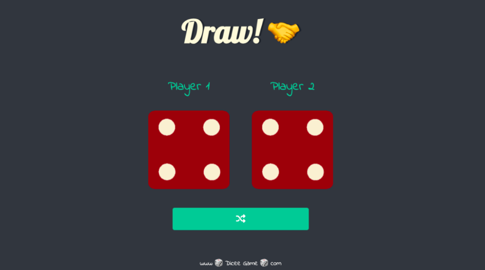
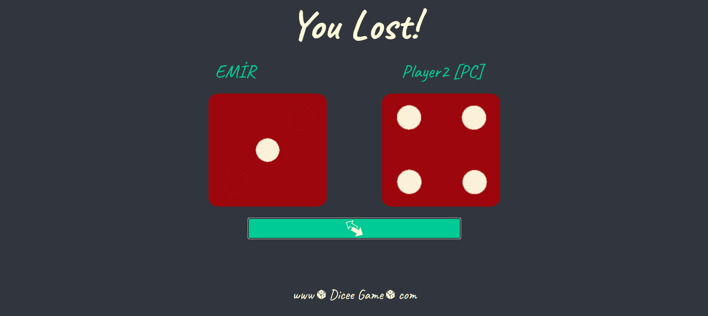
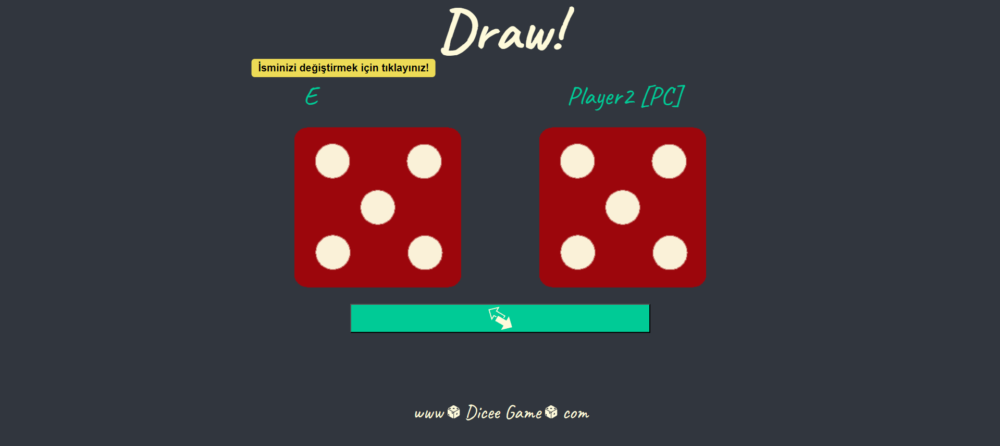
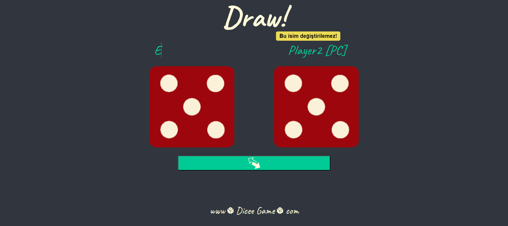

# Zar Oyunu (Dice Game)

Bu proje, kullanıcıya ve bilgisayara rastgele zar atma imkanı sunan bir zar oyunudur. Oyun sonucunda kazanan, kaybeden veya berabere kalma durumu ekranda gösterilir. Ayrıca, kullanıcı zarları dönerken "Wait" mesajı görecek ve 3 saniye sonunda sonuç gösterilecektir.

## İçindekiler

- [Genel Bakış](#genel-bakış)
- [Özellikler](#özellikler)
- [Kullanılan Teknolojiler](#kullanılan-teknolojiler)
- [Kurulum](#kurulum)
- [Kullanım](#kullanım)
- [Ekran Görüntüleri](#ekran-görüntüleri)
- [Katkıda Bulunma](#katkıda-bulunma)
- [Lisans](#lisans)

## Genel Bakış

Bu zar oyunu iki oyuncu arasında oynanır: Kullanıcı (Player1) ve Bilgisayar (Player2). Her iki oyuncu da zar atar ve sonuçlara göre şu durumlar ortaya çıkar:

- **You Win**: Kullanıcı kazanır.
- **Draw**: Berabere.
- **You Lost**: Bilgisayar kazanır.
- **Wait**: Zarlar dönerken ekranda görünen durum.

## Özellikler

- Kullanıcı ve bilgisayar için rastgele zar atma.
- Kazanan, kaybeden veya berabere durumu gösterimi.
- Zarlar dönerken "Wait" mesajı ile kullanıcı bilgilendirilir.
- 3 saniye sonra zar sonuçları ekranda belirir.

## Kullanılan Teknolojiler

- **React.js**: Kullanıcı arayüzü geliştirme.
- **JavaScript**: Oyun mantığını yönetme.
- **CSS**: Tasarım ve stil.

## Kurulum

Projeyi yerel bilgisayarınıza kurmak için aşağıdaki adımları takip edebilirsiniz:

1. Bu repoyu klonlayın:
   ```bash
   git clone https://github.com/behcetmuhammed/World-Series-of-Dice.git
   ```
2. Proje dizinine gidin:

   ```bash
   cd WorldSeriesDice
   ```

3. Gerekli bağımlılıkları yükleyin:

   ```bash
   npm install
   ```

4. Uygulamayı çalıştırın:

   ```bash
   npm run dev
   ```

5. Uygulama tarayıcınızda açılacaktır:
   ```bash
   http://localhost:****
   ```

## Kullanım

- Oyunu başlatmak için "Play" butonuna tıklayın.
- Zarlar dönerken ekranda "Wait" mesajı görünür.
- 3 saniye sonra sonuçlar görüntülenir.
- Sonuca göre "You Win", "You Lost" veya "Draw" mesajı gösterilir.

## Ekran Görüntüleri

### Ana Ekran



### Zar Sonuçları

- Bekleme Ekranı
  
- Kazanma Mesajı
  
- Berabere Mesajı
  
- Kaybetme Mesajı
  
- İsim Yenileme Ekranı
  
- Bilgisayar [Player2] İsim Ekranı
  

## Katkıda Bulunma

Katkıda bulunmak istiyorsanız lütfen aşağıdaki adımları takip edin:

1. Bu repoyu fork edin.
2. Yeni bir dal oluşturun (`git checkout -b özellik-ismi`).
3. Değişikliklerinizi işleyin (`git commit -m 'Yeni özellik ekle'`).
4. Dalınıza push yapın (`git push origin özellik-ismi`).
5. Bir Pull Request açın.

## Lisans

Bu proje MIT Lisansı ile lisanslanmıştır. Detaylı bilgi için `LICENSE` dosyasını inceleyebilirsiniz.
